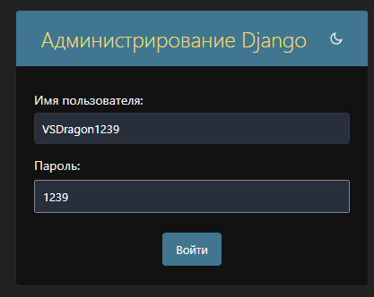

# Shop Starry Dragon 3D models

```
pip install django
```
```
cd ShopProject
```
```
py manage.py runserver
```

Админка/пользователь:

```
VSDragon1239
```
```
1239
```
## Основные страницы:

- Это всё как должно работать в идеале... Когда-нибуть...
- Главная (Home)
  - с кратким обзором и быстрый доступ к категориям 
  - (например, "Модели для игр", "Технические детали", "Фигурки").


- Каталог товаров (Catalog)
  - Возможность фильтрации по категориям, тегам, цене, рейтингу, новизне.
    - Каждая модель имеет: 
      - Изображение/рендер. 
      - Описание (размеры, совместимость с принтерами, материалы). 
      - Цена. 
      - Рейтинг и отзывы.


- Карточка товара (Product Detail)
  - Подробная информация:
    - Несколько изображений/360° обзор. 
    - Файлы для скачивания (после покупки). 
    - Советы по печати (настройки принтера, тип материала). 
    - Видео/графика, демонстрирующая результат. 
    - Список "Рекомендуемых моделей" (кросс-продажи).


- Корзина (Cart)
  - Отображение добавленных товаров.
  - Подсчет общей стоимости.
  - Возможность изменения количества товаров.
  - Кнопка "Перейти к оплате".


- Оформление заказа (Checkout)
  - Поля для заполнения:
  - Личные данные (имя, email).
  - Способ оплаты (например, PayPal, Stripe).
  - Подтверждение заказа и переход к оплате.


- Профиль пользователя (User Profile)
  - Вкладки:
    - Мои заказы: История покупок с кнопками для повторного скачивания.
    - Избранное: Сохраненные модели.
    - Настройки: Изменение пароля, почты.


- О нас (About Us)
  - Краткая история и миссия магазина.
  - Информация о создателях и их опыте.


- Контакты (Contact Us)
  - Форма обратной связи.
  - Email и социальные сети.
  - FAQ для ответов на популярные вопросы.


- Административная панель (Admin Panel)
  - Управление товарами, категориями и пользователями.
  - Статистика по продажам.
  - Отчеты о заказах.


- Политика конфиденциальности (Privacy Policy)
  - Описание, как обрабатываются личные данные пользователей.


Можно добавлять товары от своего username, но покупать свои же нельзя!

